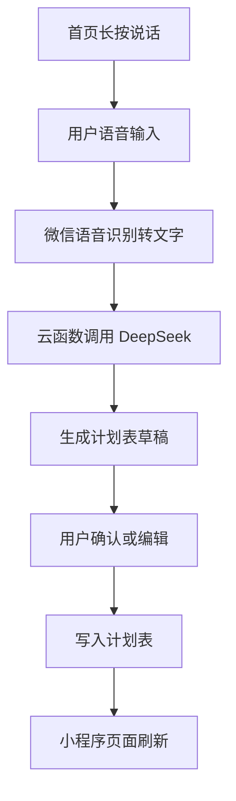

# MyForest 小程序设计说明

## 项目定位

MyForest 是一个面向两人共同使用的微信小程序，核心目标是把“计划表、专注计时、已完成记录、共享可见”结合起来。

第一版不做复杂社交和小组管理，只做最小可用闭环：

- 输入邀请码后进入同一个共享空间。
- 两个用户可以互相看到计划表、今日状态和完成记录。
- 用户可以通过首页长按语音，让 AI 帮忙生成计划表草稿。
- 用户确认计划后写入计划表。
- 通过手动完成或专注计时完成后，记录到已完成表。
- 后续统计基于计时记录、完成标签和用户维度生成。

## 技术方向

- 前端：微信小程序原生项目，TypeScript + Less。
- 后端：微信云开发，使用云数据库和云函数。
- 语音识别：优先使用微信小程序语音能力或同声传译能力。
- AI：DeepSeek 只通过云函数调用，API Key 不放在小程序端。

## 邀请码入口

第一版不做创建小组、加入小组、成员管理。

用户打开小程序后的流程：

1. 如果用户未通过邀请码，先展示邀请码输入页。
2. 用户输入邀请码。
3. 云函数校验邀请码。
4. 校验通过后，把用户绑定到同一个 `sharedSpaceId`。
5. 进入小程序主界面后，同一 `sharedSpaceId` 下的用户默认互相可见计划和状态。

第一版邀请码先写死一个固定值，便于快速完成两人使用场景。后续如果需要更多共享空间，再把邀请码改成云数据库配置。

## 首页设计

首页是最高频入口，主要展示今日概览和两个主操作。

今日概览：

- 今日计划数。
- 今日已完成数。
- 今日专注时长。
- 对方当前状态，例如是否正在专注。

核心按钮：

- 长按说话做计划表：按住录音，松开后语音识别，交给 DeepSeek 生成计划草稿。
- 开始计时：进入计时入口，可以选择已有计划开始，也可以选择标签临时开始。

如果用户还没通过邀请码，首页只展示邀请码输入，不展示核心功能。

### 首页布局草案

首页从上到下分为四块：

1. 顶部问候区。
2. 今日概览卡片。
3. 两个核心操作按钮。
4. 今日计划和对方状态预览。

顶部问候区：

- 展示当前用户昵称。
- 展示日期和一句轻量提示，例如“今天也慢慢种一棵树”。
- 右上角放设置入口。

今日概览卡片：

- 今日计划数。
- 今日已完成数。
- 今日专注时长。
- 逾期数量。

核心操作按钮：

- 主按钮：长按说话做计划表。
- 次按钮：开始计时。

今日计划和对方状态预览：

- 展示自己接下来最近的 1 到 2 条计划。
- 展示对方今天的计划数量和当前是否正在专注。
- 点击后进入计划表日视图。

首页视觉建议：

- 使用浅绿色、米白色、柔和卡片背景。
- 两个核心按钮要足够大，适合单手点击。
- 长按说话按钮可以做成圆形或胶囊形，按住时显示录音波纹。

## 计划表

计划表用于展示未来或当天要做的事情，不等同于已完成记录。

### 计划表整体结构

计划表页面包含：

- 顶部月份标题和左右切换按钮。
- 成员筛选器。
- 月视图日历。
- 选中日期的日视图入口或展开区域。

第一版推荐采用“月视图 + 日视图独立页面”的结构：

- 计划表页默认展示月视图。
- 点击某一天后跳转到日视图页面。
- 后续如果想增强体验，再做月视图下方展开日视图的动画。

页面底部或右下角提供“新增计划”按钮：

- 手动新增计划。
- 语音新增计划。

### 月视图

月视图以日历形式展示一个月。

每一天只展示摘要，避免信息过载：

- 日期数字。
- 最多展示 2 条计划短文本。
- 每条短文本由“用户昵称缩写 + 标签名”组成，例如“张 英语”“李 代码”。
- 标签名最多显示 2 到 4 个字，超出省略。
- 超过 2 条时显示 `+N`，例如当天还有 3 条未展示就显示 `+3`。
- 日期格子底部可以显示小圆点表示当天计划数量，圆点颜色跟用户颜色一致。
- 如果当天有逾期计划，可以显示小红点或 `!`。

点击某一天后进入日视图。

推荐第一版不要在月视图展示完整计划标题。月视图只负责快速扫一眼“哪天有事、谁有事、大概是什么标签”，完整内容放到日视图。

月视图点击动效：

- 点击日期格子时轻微放大。
- 被选中日期背景变浅绿色。
- 跳转日视图时使用淡入和上滑效果。

### 日视图

日视图展示某一天的详细计划，分为两个区域。

日视图顶部：

- 显示日期，例如“5 月 23 日 星期六”。
- 提供返回月视图按钮。
- 保留成员筛选器。
- 提供新增计划按钮。

时间轴：

- 用于明确几点到几点的计划。
- 示例：`09:00 - 10:00 张三｜英语｜背单词`。

当天事项：

- 用于只确定今天要做，但不限定具体时刻的事。
- 示例：`今天｜李四｜运动｜30分钟`。
- 它表示今天想做或需要做这件事，但不要求在某个固定时间完成。

计划卡片展示字段：

- 用户头像或昵称缩写。
- 计划标题。
- 主题标签。
- 时间信息，例如 `09:00 - 10:00`、`今天`、`晚上`。
- 状态标签，例如待开始、进行中、已完成、逾期。
- 操作入口，例如开始计时、标记完成、编辑。

未定计划：

- 如果计划连日期也不确定，不放入某一天。
- 统一进入“未定计划”区，后续补充日期后再进入月视图。

未定计划第一版可以做成日视图底部入口：

- 显示“还有 N 个未定计划”。
- 点击进入计划管理列表。

### 成员筛选

计划表顶部提供成员筛选：

- 全部。
- 用户 A。
- 用户 B。

默认展示全部成员。切换成员后，月视图摘要、日视图时间轴、当天事项、逾期标签都只展示筛选后的数据。

### 两人视觉区分

第一版建议用“头像或昵称缩写 + 固定颜色”区分两个人。

- 优先展示微信头像；头像加载失败时展示昵称第一个字。
- 每个用户绑定一个固定颜色，进入共享空间后保持不变。
- 用户 A 使用绿色系，用户 B 使用蓝色系，避免和逾期红色冲突。
- 月视图中用昵称缩写和颜色点区分。
- 日视图中用头像、昵称和左侧色条区分。
- 逾期仍统一用红色标签，不用用户色，避免状态不清楚。

### 计划状态

计划状态包括：

- `pending`：待开始。
- `in_progress`：正在专注计时中。
- `completed`：已完成，计划表打勾，并已有对应已完成记录。
- `overdue`：已逾期。
- `cancelled`：已取消。

逾期规则：

- 有明确结束时间的计划，当前时间超过结束时间且未完成，则显示逾期。
- 只有日期但没有具体时刻的当天事项，当天 23:59 后仍未完成，则显示逾期。
- 日期也不确定的未定计划，不自动逾期。
- 逾期不会自动进入已完成表，也不会计入统计。
- 逾期计划仍可以继续完成，完成后状态变为 `completed`。
- 逾期计划完成后，已完成表保留“逾期完成”标记，方便后续复盘。

### 计划提醒

如果计划有明确开始时间，小程序在开始前 5 分钟提醒用户准备开始。

提醒规则：

- 第一版只对有明确 `date` 和 `startTime` 的计划发送提醒。
- 提醒内容说明计划即将开始，例如“英语将在 5 分钟后开始”。
- 用户点击提醒后，直接打开对应计划详情。
- 如果用户要通过计时完成这个计划，可以从提醒打开的位置直接进入“开始计时”。
- 微信小程序通知优先使用订阅消息能力；首次使用时需要用户授权。

## 已完成表

已完成表只记录真实完成过的事情。

### 已完成表页面布局

已完成表从上到下分为：

1. 筛选区。
2. 汇总区。
3. 完成记录列表。

筛选区：

- 成员筛选：全部、用户 A、用户 B。
- 类型筛选：全部、手动完成、计时完成。
- 时间筛选：今天、本周、本月、自定义。

汇总区：

- 完成数量。
- 计时完成总时长。
- 最常用标签。

完成记录列表：

- 按日期分组展示。
- 每条记录显示完成标签、完成详情、用户、完成时间。
- 计时完成额外显示实际开始时间、结束时间和分钟数。
- 逾期完成显示“逾期完成”标记。

完成方式分两种：

- 手动完成：第一版计划表里的任务默认都是手动完成，用户可以直接勾选完成。
- 计时完成：如果某个计划实际是通过专注计时完成的，可以从计划卡片或提醒入口开始计时，计时结束后关联该计划并写入已完成表。

### 手动完成流程

1. 用户点击计划卡片。
2. 点击“标记完成”。
3. 弹出确认。
4. 确认后计划表打勾。
5. 写入已完成表。

### 计时完成流程

1. 用户点击计划卡片。
2. 点击“开始专注”。
3. 选择计时模式。
4. 进入计时页。
5. 计时过程中可以暂停和继续。
6. 停止计时。
7. 选择完成标签。
8. 可选填写具体做了什么。
9. 确认后计划表打勾。
10. 写入已完成表。

如果用户停止计时后选择“不算完成”，不打勾，也不写入已完成表。

如果计时是从计划卡片或计划提醒进入的，完成记录会关联原计划。若原计划当时已经逾期，已完成表中保留“逾期完成”标记。

### 计时模式

开始计时时提供两种模式：

- 深度计时：适合学习、工作这类需要强专注的任务。中途退出小程序时自动暂停计时，回到小程序后用户可以继续。
- 浅度计时：适合运动、做家务、阅读纸质书这类不一定一直看手机的任务。中途退出小程序后继续计时。

计时记录中保存 `timerMode`，便于后续复盘不同类型的专注时长。

## 完成标签和详情

完成标签用于统计，完成详情用于补充说明。

完成标签示例：

- 英语。
- 数学。
- 写代码。
- 阅读。
- 运动。

标签允许用户自己配置。第一版可以内置几个常用标签，同时支持用户新增、编辑和删除标签。

标签在创建或编辑时选择可见范围：

- 共用标签：同一共享空间内两个人都能看到和使用，适合“英语”“运动”“写代码”这类共同分类。
- 私人标签：只有创建者自己能看到和使用，适合个人习惯、私人事项或不想共享的细分类。

添加计划时也需要选择主题标签。这个标签会作为计划的默认完成标签，后续手动完成或计时完成时可以直接沿用，也可以在完成确认页修改。

停止计时后的完成页中，上方展示快捷标签。用户点击标签即可完成分类。

下方提供“具体做了什么”输入框：

- 可以手动打字。
- 可以语音快速录入。
- 可以不填。

示例：

- 完成标签：英语。
- 完成详情：背完 Unit 3 单词。
- 实际开始时间：09:00。
- 实际结束时间：09:40。
- 实际分钟数：40。

统计时，计时完成型记录会按标签汇总时长，例如“英语本周 3 小时 20 分钟”。

## 计时页设计

计时页用于正在进行的专注任务。

计时页包含：

- 当前任务标题。
- 当前标签。
- 计时模式：深度计时或浅度计时。
- 大号计时器。
- 暂停/继续按钮。
- 结束按钮。
- 当前任务所属计划信息。

如果从计划进入计时：

- 展示计划标题、计划时间和是否逾期。
- 结束后进入完成确认页。

如果从首页临时开始计时：

- 先选择标签。
- 可选填写临时任务名称。
- 结束后生成已完成记录，但不关联计划。

深度计时状态：

- 页面强调“保持专注”。
- 退出小程序会暂停。

浅度计时状态：

- 页面强调“正在记录”。
- 退出小程序继续计时。

## 完成确认页设计

完成确认页在停止计时或手动完成时出现。

页面内容：

- 默认完成标签。
- 可切换标签。
- 具体做了什么输入框。
- 语音输入按钮。
- 实际计时时长。
- 是否关联计划。
- 如果是逾期计划，显示“逾期完成”提示。

主要操作：

- 确认完成。
- 不算完成。
- 返回继续计时。

对于手动完成，完成确认页可以更轻：

- 展示计划标题。
- 展示默认标签。
- 用户确认后直接写入已完成表。

## 标签管理页设计

标签管理页用于维护用户自己的标签。

页面包含：

- 共用标签列表。
- 私人标签列表。
- 新增标签按钮。

新增或编辑标签时可设置：

- 标签名称。
- 标签颜色。
- 可见范围：共用或私人。

共用标签在共享空间内两个人都能使用。私人标签只对创建者可见。

## 统计页设计

统计页用于查看专注和完成情况。

页面顶部筛选：

- 时间范围：日、月、年。
- 成员：全部、用户 A、用户 B。
- 标签：全部或某个标签。

核心卡片：

- 总专注时长。
- 计时完成次数。
- 手动完成次数。
- 最常用标签。

图表第一版可以先简单做：

- 标签时长排行。
- 每日专注时长列表。
- 板块时长汇总。

第一版不强制做复杂图表，先用列表和进度条即可。

## 设置页设计

设置页放低频配置。

设置项：

- 用户昵称和头像。
- 邀请码状态。
- 标签管理入口。
- 通知授权状态。
- 默认计时模式。
- 关于小程序。

## AI 计划表智能填写

DeepSeek 第一版的能力边界非常明确：只负责计划表智能填写。

AI 可以做：

- 把口述内容整理成一个或多个计划草稿。
- 识别日期。
- 识别具体时间段。
- 识别模糊时间，例如“晚上”“下午”。
- 识别预计时长。
- 推断板块和默认完成标签。
- 标记日期或时间是否确定。

AI 不可以做：

- 不直接写入已完成表。
- 不直接开始专注计时。
- 不直接把计划标记完成。
- 不直接修改统计。
- 不静默保存计划。

用户必须在确认页确认后，计划才会写入数据库。

### AI 语音流程



### 固定 JSON 合同

DeepSeek 必须返回固定 JSON。程序只识别结构化字段，不解析 AI 的解释文字。

顶层字段：

- `intent`
- `sourceText`
- `plans`
- `warnings`

第一版 `intent` 只允许 `create_plans`。

每条计划必须包含：

- `title`
- `section`
- `defaultTag`
- `date`
- `startTime`
- `endTime`
- `timeText`
- `estimatedMinutes`
- `completionMode`
- `certainty`

字段规则：

- `date` 允许为 `YYYY-MM-DD` 或 `null`。
- `startTime` 和 `endTime` 允许为 `HH:mm` 或 `null`。
- 模糊时间如“晚上”不能硬编码成具体时间，要放入 `timeText`，并把 `certainty.time` 标记为 `vague`。
- `completionMode` 第一版默认返回 `manual`；如果后续需要 AI 区分任务类型，再扩展为 `manual` 或 `timed`。
- 校验失败时不允许保存，只提示重新语音输入或手动填写。

示例：

```json
{
  "intent": "create_plans",
  "sourceText": "明天上午九点到十一点写代码，晚上背英语四十分钟",
  "plans": [
    {
      "title": "写代码",
      "section": "工作",
      "defaultTag": "写代码",
      "date": "2026-05-23",
      "startTime": "09:00",
      "endTime": "11:00",
      "timeText": null,
      "estimatedMinutes": 120,
      "completionMode": "manual",
      "certainty": {
        "date": "certain",
        "time": "certain"
      }
    },
    {
      "title": "背英语",
      "section": "学习",
      "defaultTag": "英语",
      "date": "2026-05-23",
      "startTime": null,
      "endTime": null,
      "timeText": "晚上",
      "estimatedMinutes": 40,
      "completionMode": "manual",
      "certainty": {
        "date": "certain",
        "time": "vague"
      }
    }
  ],
  "warnings": []
}
```

## 数据模型草案

### users

- `openid`
- `nickname`
- `avatarUrl`
- `sharedSpaceId`
- `inviteVerified`
- `createdAt`
- `updatedAt`

### invite_codes

- `code`
- `sharedSpaceId`
- `enabled`
- `expiresAt`
- `createdAt`

### plans

- `userId`
- `sharedSpaceId`
- `title`
- `section`
- `defaultTag`
- `date`
- `startTime`
- `endTime`
- `timeText`
- `estimatedMinutes`
- `completionMode`
- `status`
- `dateCertainty`
- `timeCertainty`
- `reminderAt`
- `reminderStatus`
- `createdAt`
- `updatedAt`

### focus_sessions

- `userId`
- `sharedSpaceId`
- `planId`
- `startAt`
- `endAt`
- `actualMinutes`
- `tag`
- `timerMode`
- `status`
- `pauseRecords`
- `pausedMinutes`
- `createdAt`

### completed_records

- `userId`
- `sharedSpaceId`
- `planId`
- `title`
- `section`
- `tag`
- `detail`
- `completionMode`
- `completedAt`
- `actualStartAt`
- `actualEndAt`
- `actualMinutes`
- `wasOverdue`
- `createdAt`

### tags

- `userId`
- `sharedSpaceId`
- `name`
- `color`
- `visibility`
- `enabled`
- `createdAt`
- `updatedAt`

## 统计规则

统计可以按以下维度查看：

- 日。
- 月。
- 年。
- 用户。
- 标签。
- 板块。

统计口径：

- 专注时长只统计计时完成型记录。
- 手动完成型只统计完成数量，不计入专注时长。
- 标签统计基于 `completed_records.tag`。
- 成员筛选为“全部”时展示共享空间总计；筛选单人时只展示该用户数据。

## 第一版范围

第一版做：

- 邀请码入口。
- 固定邀请码。
- 两人共享计划表。
- 首页语音做计划表。
- AI 计划草稿确认。
- 月视图和日视图。
- 计划完成和逾期状态。
- 计划开始前 5 分钟提醒。
- 专注计时。
- 计时暂停和继续。
- 深度计时和浅度计时。
- 已完成表。
- 用户自定义标签。
- 标签可设置为共用或私人。
- 标签统计。

第一版不做：

- 创建小组和成员管理。
- 聊天。
- 排行榜。
- 好友系统。
- 付费系统。
- 严格防作弊。
- AI 自动完成任务。
- AI 自动开始计时。

## 仍需继续确认的问题

- 计划提醒使用微信订阅消息时，用户拒绝授权后要不要提供备用提醒方式？
- 深度计时退出小程序后自动暂停时，要不要给用户一个“已暂停”的系统提示？
- 月视图的 `+N` 是否只统计计划，还是同时包含逾期未完成计划？
